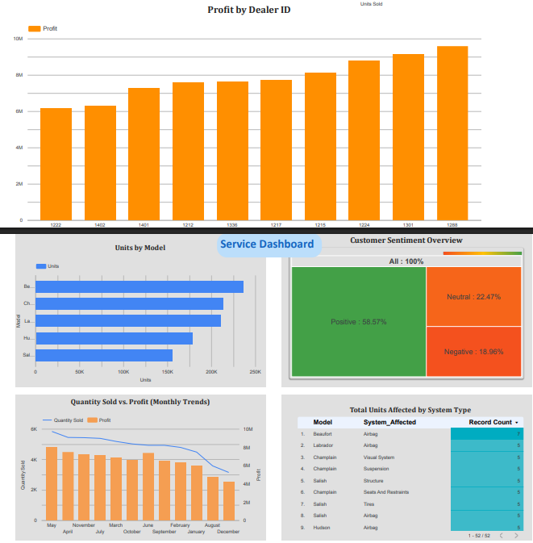

# Car Sales Dashboard Project

This project was completed as part of the **IBM Data Analyst Professional Certificate** – Course 3: *Data Visualization and Dashboards with Excel and Cognos* on Coursera.

It consists of two major parts:
- **Part 1**: Excel-based visualizations of car sales data
- **Part 2**: Interactive dashboards created using Google Looker Studio

---

## 🧩 Project Structure

## 🧩 Project Structure

- `data/`
  - `Automotive_Industry.xlsx` (original dataset)
- `excel-visualizations/`
  - `CarSalesByModelEnd.xlsx` (Excel visual charts)
- `looker-dashboard/`
  - `Sales_and_Service_Dashboard.pdf` (Looker Studio export)
  - `dashboard_screenshot.png` (optional image)
- `screenshots/`
  - `dashboard_preview.png` (image used in README)
- `README.md`

## 📊 Part 1: Excel Visualizations

Using the dataset `Automotive_Industry.xlsx`, the following charts were created in **Excel for the Web**:

1. **Quantity Sold by Dealer ID** (Bar Chart)
2. **Profit by Date and Model** (Line Chart)
3. **Profit by Year and Dealer ID** (Column Chart)
4. **Profit of Hudson Models by Dealer ID** (Line Chart, formatted with custom colors)

🔗 Output file: [`CarSalesByModelEnd.xlsx`](excel-visualizations/CarSalesByModelEnd.xlsx)

---

## 📈 Part 2: Looker Studio Dashboard

Created using **Google Looker Studio**, split into two tabs:
- **Sales Dashboard**
  - Total profit
  - Quantity sold
  - Profit by Dealer
  - Quantity sold by model
  - Avg quantity sold
- **Service Dashboard**
  - Recalls by model
  - Customer sentiment
  - Quantity vs Profit by Month
  - Recalls heatmap by system

📄 PDF Output: [`Sales_and_Service_Dashboard.pdf`](looker-dashboard/Sales_and_Service_Dashboard.pdf)

> ⚠️ Note: Built using Google Looker Studio via IBM Coursera hands-on lab. Data source connected through Google Sheets and IBM Accelerator Catalog.

---

## 📦 Dataset Source

- IBM Accelerator Catalog → [Automotive Dataset](https://community.ibm.com/accelerators/?context=analytics&type=Data&product=Cognos%20Analytics&industry=Automotive)
- Terms of Use: [IBM Developer Terms](https://developer.ibm.com/terms/ibm-developer-terms-of-use/)

---

## 🏆 Skills Demonstrated

- Excel Pivot Tables & Charting
- Dashboard Design (Sales & Service KPIs)
- Data storytelling & chart formatting
- Google Looker Studio (Visual & interactive dashboards)

---

## 📸 Dashboard Preview

---

## ✅ Project Outcome

This assignment fulfills all requirements in the IBM course:
- Appropriate chart types and formatting
- Dashboard structure as per rubric
- Proper KPIs captured and visualized

